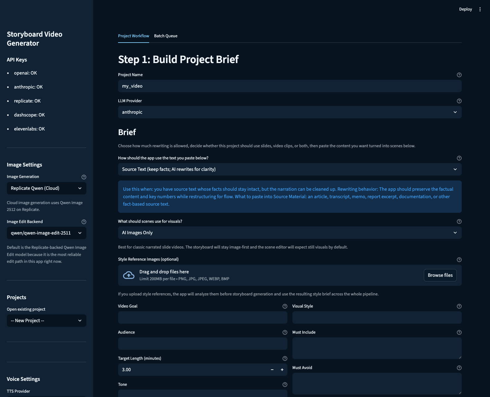

<p align="center">
  
</p>

# Cathode

Cathode is a local-first Streamlit app and MCP server for turning rough notes, source text, or a finished script into a narrated explainer video.

The default pitch is simple:

1. paste the source
2. generate the storyboard
3. generate the assets
4. render the video

Most of the time, that is enough. The scene editor is there for surgical fixes, not because the happy path should feel heavy.

## What It Does

- brief-driven storyboard generation
- image scenes and uploaded video scenes
- scene-by-scene narration, prompt, and asset editing
- local project folders with inspectable files
- local MP4 render
- MCP tools for agent/client-driven video generation

## Demo Assets

- Product demo: `docs/assets/storyboard-demo.mp4`
- LocalLLaMA short demo: `docs/assets/localllama-demo.mp4`
- Mixed-media workflow clip: `docs/assets/ui-workflow-clip.mp4`
- Expanded scene editor screenshot: `docs/assets/scene-preview-expanded.png`
- Sample prompt brief: `docs/demo-brief.md`



## Provider Model

Cathode is env-driven on purpose.

- `OPENAI_API_KEY` and/or `ANTHROPIC_API_KEY`: storyboard LLMs
- `REPLICATE_API_TOKEN`: Qwen image generation, image edit, and Chatterbox voice
- `ELEVENLABS_API_KEY`: ElevenLabs narration
- `DASHSCOPE_API_KEY` or `ALIBABA_API_KEY`: optional DashScope image edit
- Kokoro remains the always-available local voice option

Only configured providers appear in the UI. If you leave a key out, the UI stays quieter.

## Local Vs Cloud

Cathode is local-first, not cloud-hosted.

- the app runs locally
- projects live under `projects/<project>/`
- previews and final renders happen locally
- uploaded stills and clips stay local
- Kokoro is local TTS

For visuals, the built-in AI image path is currently cloud-backed through Replicate. If you want a fully local visual workflow today, use uploaded images and uploaded clips.

## Quick Start

```bash
./start.sh
```

Manual app run:

```bash
/opt/homebrew/bin/python3.10 -m streamlit run app.py --server.port 8517
```

Default port is `8517`. Override it with `STREAMLIT_PORT` when using `./start.sh`.

Final render now uses direct `ffmpeg` orchestration and auto-prefers hardware H.264 encoders when the local ffmpeg build supports them. Override with `CATHODE_VIDEO_ENCODER` or force CPU fallback with `CATHODE_DISABLE_HW_ENCODER=1`.

## MCP Server

Cathode also ships as an MCP server.

Run over stdio:

```bash
/opt/homebrew/bin/python3.10 cathode_mcp_server.py --transport stdio
```

Run over Streamable HTTP:

```bash
CATHODE_MCP_PORT=8765 /opt/homebrew/bin/python3.10 cathode_mcp_server.py --transport streamable-http
```

Docker:

```bash
docker build -t cathode-mcp .
docker run --rm -p 8765:8765 cathode-mcp
```

Primary MCP tools:

- `make_video`
- `get_job_status`
- `cancel_job`
- `rerun_stage`
- `list_projects`

Primary MCP resources:

- `project://{project_name}/plan`
- `project://{project_name}/artifacts`

## Setup

### System Dependencies

macOS:

```bash
brew install python@3.10 ffmpeg espeak-ng
```

Ubuntu / Debian:

```bash
sudo apt-get install python3.10 ffmpeg espeak-ng
```

### Python Dependencies

```bash
/opt/homebrew/bin/python3.10 -m pip install -r requirements.txt
```

### Environment

Copy `.env.example` to `.env` and fill in only what you need.

Example:

```bash
OPENAI_API_KEY=
ANTHROPIC_API_KEY=
REPLICATE_API_TOKEN=
ELEVENLABS_API_KEY=
DASHSCOPE_API_KEY=
ALIBABA_API_KEY=
IMAGE_EDIT_PROVIDER=
IMAGE_EDIT_MODEL=qwen/qwen-image-edit-2511
STREAMLIT_PORT=8517
CATHODE_VIDEO_ENCODER=auto
CATHODE_DISABLE_HW_ENCODER=0
```

## Workflow

### Step 1

Build the brief:

- project name
- source mode
- goal
- audience
- target length
- tone
- visual style
- source material
- optional footage notes

### Step 2

Edit scenes if needed:

- narration
- visual prompt
- on-screen text
- image generation or upload
- video upload
- image edit
- per-scene preview

### Step 3

Render the final video.

Timing is narration-led:

- image scenes hold for narration duration
- video scenes trim to narration duration
- short clips can freeze on the last frame to stay in sync

## Batch Rebuild

```bash
python3.10 batch_regenerate.py
python3.10 batch_regenerate.py --projects demo_one,demo_two
python3.10 batch_regenerate.py --dry-run
```

## Tests

```bash
PYTHONPATH=. /opt/homebrew/bin/python3.10 -m pytest -q
```

## Repository Layout

```text
app.py
batch_regenerate.py
cathode_mcp_server.py
core/
prompts/
tests/
docs/assets/
projects/
output/
```

## License

MIT
