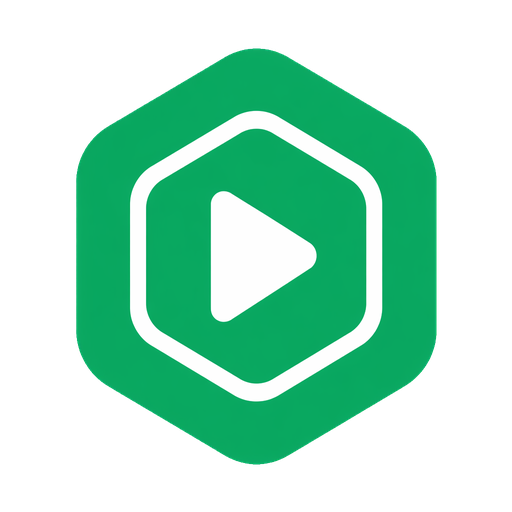

<p align="center">
  
</p>

# betTube Studio

betTube Studio is a local-first explainer-video pipeline with three main surfaces:

- a React + FastAPI control room for the current workspace-first UI
- a legacy Streamlit app for the older manual step-by-step path
- an MCP server for agent/client-driven runs

It turns rough notes, source text, or a finished script into a local project folder plus a rendered MP4, and it now supports classic, hybrid, and motion-first composition modes.

## Watch The Demo

[Watch the betTube Studio demo](https://innovation.gcp/bettube/video/785f8ef6-6e14-4b60-b03f-70442b170e8d).

betTube Studio now has four practical lanes:

1. `React/FastAPI control room`
   Fill in Brief Studio, hit the primary button, watch the background job/logs, then land on the final MP4.
2. `Legacy Streamlit app`
   Use the older manual step-by-step path when you want a more explicit scene-by-scene workflow.
3. `MCP workflow`
   Call `make_video` from an agent or client and let betTube Studio build the local project in the background.
4. `Live demo workflow`
   Launch or attach to a real app, capture fresh footage, review it, then feed the approved clips into betTube Studio for final render.

If you only remember one thing, remember this:

- most users only need the React/FastAPI app or MCP path
- the packaged live-demo skill is for cases where real UI footage is the story
- the scene editor is there for surgical fixes, not because the happy path should feel heavy

## What It Does

- brief-driven storyboard generation with `source_mode` and `composition_mode`
- image scenes, video scenes, and Remotion-backed motion scenes
- a one-button GUI background job path plus storyboard-only/manual editing when you want it
- scene-by-scene narration, prompt, media, preview, and operator-log editing
- persisted demo-target metadata and reviewed footage manifests for live-demo runs
- local MP4 render through `ffmpeg` or Remotion, depending on the resolved render backend
- MCP tools and web API job routes for agent/client-driven video generation

## Pick A Lane

### 1. React/FastAPI Control Room

Use this for the current workspace-based UI.

```bash
./start.sh --react
```

The main workspaces are:

- `Brief`
- `Scenes`
- `Render`
- `Queue`
- `Settings`

In `Brief Studio`, there are now two clearly separate actions:

1. primary path: start the full background video run
2. secondary path: generate or rebuild only the storyboard

If demo-target context or reviewed footage is present, the GUI prefers the hybrid path automatically unless you explicitly choose something else.

### 2. Legacy Streamlit App

Use this when you want the older manual step-by-step flow.

```bash
./start.sh
```

This is still supported, but the React/FastAPI control room is the more current operator surface.

### 3. Agent / MCP

Use this when an agent or client should drive betTube Studio programmatically.

```bash
/opt/homebrew/bin/python3.10 bettube_studio_mcp_server.py --transport stdio
```

The core tool is `make_video`. It can inspect a bounded workspace, accept explicit source files, persist demo-target metadata, and accept reviewed `footage_paths` / `footage_manifest` inputs for mixed-media demos.

The React GUI and the MCP path now converge on the same persisted background-job model instead of maintaining separate orchestration logic.
The web stack also exposes the same job model through `POST /api/jobs/make-video`.

### 4. Live Product Demo Skill

Use this when the video should prove a real running product.

The packaged skill now lives in:

- `skills/bettube-studio-project-demo/`
- `.claude/skills/bettube-studio-project-demo/`

Its flow is:

1. bootstrap betTube Studio
2. prepare a live capture session
3. launch or attach to the target app
4. capture fresh states in a real browser
5. review the footage
6. hand approved clips into betTube Studio
7. render

This path is capture-first and review-first. It does not assume existing README screenshots are good enough.
The QC pass is supposed to run inside Codex or Claude as a spawned reviewer sub-agent looking at extracted images only, not as some separate external “vision model” workflow. The reviewer prompt should stay tiny and human, more like “hey, check out my demo vid” than a schema dump.
The parent agent should save that raw reviewer reply, translate it into betTube Studio’s structured `accept / warn / retry` observations, and then let the deterministic review rules decide retries and handoff safety.

In practice, that review loop is:

1. `extract_review_frames.py` creates the image bundle.
2. A spawned worker sub-agent sees only those frames plus the short gut-check prompt.
3. The parent agent saves the raw reply, seeds `review_observations.template.json` with `init_review_observations.py`, fills the structured observations, and runs `review_bundle.py`.

The packaged live-demo lane now also has a real capture driver and retry-plan tool:

- `capture_live_demo.py`: run a Playwright-backed walkthrough from a capture plan and keep raw browser video, trace, screenshots, and a step manifest.
- `apply_retry_actions.py`: mutate the capture plan from bounded retry actions before rerunning capture.

## Remotion And Composition Modes

betTube Studio no longer stops at still-image and clip-only storyboards.

- `classic`
  image + video scenes, with `ffmpeg` as the default final render backend
- `hybrid`
  mix image, video, and motion scenes in one project; Remotion is the default render backend when the local toolchain is available
- `motion_only`
  build the project around motion scenes plus narration

Motion scenes are template-first in the current product and render through the local Remotion toolchain bundled in `frontend/`. The React app only exposes motion and hybrid options when the Remotion toolchain is actually runnable on this machine.

Important timing rule: narration audio is still the source of truth. betTube Studio computes scene durations, video trim/speed/hold behavior, and the Remotion manifest from the same timing contract, so hybrid renders stay in sync instead of drifting.

## Demo Assets

- Product demo: `docs/assets/__storyboard-demo.mp4`
- LocalLLaMA short demo: `docs/assets/localllama-demo.mp4`
- Mixed-media workflow clip: `docs/assets/ui-workflow-clip.mp4`
- Brief Studio screenshot: `docs/assets/brief-studio-focus.png`
- Motion scene workspace screenshot: `docs/assets/motion-scene-focus.png`
- Render workspace screenshot: `docs/assets/render-finished-focus.png`
- Sample prompt brief: `docs/demo-brief.md`

### Current UI

<p align="center">
  
</p>

<p align="center">
  
  
</p>

## Provider Model

betTube Studio is env-driven on purpose.

- `OPENAI_API_KEY`: OpenAI storyboard and optional OpenAI TTS
- `ANTHROPIC_API_KEY`: Anthropic storyboard
- `REPLICATE_API_TOKEN`: Qwen image generation, Replicate-backed image edit, and Chatterbox voice
- `BETTUBE_STUDIO_LOCAL_IMAGE_MODEL`: optional local Hugging Face image generation for image scenes
- `ELEVENLABS_API_KEY`: ElevenLabs narration
- `DASHSCOPE_API_KEY` or `ALIBABA_API_KEY`: optional DashScope image edit
- `BETTUBE_STUDIO_LOCAL_VIDEO_COMMAND` and/or `BETTUBE_STUDIO_LOCAL_VIDEO_ENDPOINT`: optional local video generation for video scenes
- `BETTUBE_STUDIO_LOCAL_VIDEO_MODEL`: optional local model label or path passed through to that backend
- Node + the installed frontend workspace: local Remotion motion/hybrid rendering
- Kokoro remains the always-available local voice option

Only configured providers appear in the UI. If you leave a key out, the UI stays quieter.

## Local Vs Cloud

betTube Studio is local-first, not cloud-hosted.

- the app runs locally
- projects live under `projects/<project>/`
- previews and final renders happen locally
- uploaded stills and clips stay local
- Kokoro is local TTS
- video scenes can use a local generation backend when configured
- motion and hybrid renders happen locally through Remotion when available
- persisted job state and logs live under `projects/<project>/.bettube-studio/jobs/`

For visuals, the built-in AI image path can run either through Replicate or through a configured local Hugging Face Qwen model. If neither is configured, you can still upload stills yourself. Video scenes can come from reviewed footage, the live-demo agent path, or a configured local video backend. Motion scenes render through the local Remotion layer when the frontend toolchain is installed.

## Local Image Backend

betTube Studio can run Qwen Image locally in two ways:

- `torch` runtime for CUDA, CPU, or MPS through Hugging Face `diffusers`
- `mlx` runtime for Apple Silicon through `mflux`

Typical CUDA / generic torch setup:

```bash
/opt/homebrew/bin/python3.10 -m pip install -r requirements-local-image.txt
export BETTUBE_STUDIO_LOCAL_IMAGE_RUNTIME=torch
export BETTUBE_STUDIO_LOCAL_IMAGE_MODEL=Qwen/Qwen-Image-2512
```

Typical Apple Silicon MLX setup:

```bash
uv tool install --upgrade mflux
export BETTUBE_STUDIO_LOCAL_IMAGE_RUNTIME=mlx
export BETTUBE_STUDIO_LOCAL_IMAGE_MODEL=Qwen/Qwen-Image-2512
export BETTUBE_STUDIO_LOCAL_IMAGE_MLX_MODEL=mlx-community/Qwen-Image-2512-8bit
```

Auto mode keeps the single product-facing provider in the UI and picks MLX on Apple Silicon when `mflux` is installed; otherwise it falls back to the torch path.

Optional tuning:

```bash
export BETTUBE_STUDIO_LOCAL_IMAGE_RUNTIME=auto
export BETTUBE_STUDIO_LOCAL_IMAGE_DEVICE=auto
export BETTUBE_STUDIO_LOCAL_IMAGE_DTYPE=auto
export BETTUBE_STUDIO_LOCAL_IMAGE_STEPS=50
export BETTUBE_STUDIO_LOCAL_IMAGE_TRUE_CFG_SCALE=4.0
export BETTUBE_STUDIO_LOCAL_IMAGE_MLX_CACHE_LIMIT_GB=
export BETTUBE_STUDIO_LOCAL_IMAGE_MLX_LOW_RAM=0
```

## Local Video Backend

betTube Studio keeps local video generation generic and env-driven rather than baking in one model family.

Configure one of these:

- `BETTUBE_STUDIO_LOCAL_VIDEO_COMMAND`: betTube Studio runs a local command and passes scene data through env vars such as `BETTUBE_STUDIO_VIDEO_PROMPT`, `BETTUBE_STUDIO_VIDEO_OUTPUT_PATH`, `BETTUBE_STUDIO_VIDEO_DURATION_SECONDS`, `BETTUBE_STUDIO_VIDEO_MODEL`, and `BETTUBE_STUDIO_VIDEO_REQUEST_JSON`.
- `BETTUBE_STUDIO_LOCAL_VIDEO_ENDPOINT`: betTube Studio sends a JSON POST request with `prompt`, `output_path`, `duration_seconds`, `width`, `height`, `fps`, `scene`, and `brief`.

Your local backend can satisfy the request in any of these ways:

- write the clip directly to `BETTUBE_STUDIO_VIDEO_OUTPUT_PATH` / the request `output_path`
- return JSON with `output_path`
- return JSON with `url`
- return JSON with `b64_json`

Typical setup looks like this:

```bash
BETTUBE_STUDIO_LOCAL_VIDEO_COMMAND='python /path/to/local_video_wrapper.py'
BETTUBE_STUDIO_LOCAL_VIDEO_MODEL=/models/wan
```

Or:

```bash
BETTUBE_STUDIO_LOCAL_VIDEO_ENDPOINT=http://127.0.0.1:8787/generate
BETTUBE_STUDIO_LOCAL_VIDEO_MODEL=wan2.1
```

## Quick Start

```bash
./start.sh --react
```

Legacy Streamlit path:

```bash
./start.sh
```

Manual React + FastAPI run:

```bash
/opt/homebrew/bin/python3.10 -m uvicorn server.app:app --host 127.0.0.1 --port 9321 --reload
npm run dev --prefix frontend -- --host 127.0.0.1 --port 9322
```

Manual app run:

```bash
/opt/homebrew/bin/python3.10 -m streamlit run app.py --server.port 8517
```

Default port is `8517`. Override it with `STREAMLIT_PORT` when using `./start.sh`.
React mode uses `BETTUBE_STUDIO_API_PORT` for FastAPI (default `9321`) and `BETTUBE_STUDIO_FRONTEND_PORT` for Vite (default `9322`).

Final render now uses direct `ffmpeg` orchestration and auto-prefers hardware H.264 encoders when the local ffmpeg build supports them. Override with `BETTUBE_STUDIO_VIDEO_ENCODER` or force CPU fallback with `BETTUBE_STUDIO_DISABLE_HW_ENCODER=1`.
When Remotion is available and the project resolves to `motion_only` or `hybrid`, betTube Studio can switch the final render backend to Remotion automatically.

## Docker

The default container target runs the current React/FastAPI control room from one process: FastAPI serves `/api/*` and the built React app from the same origin.

```bash
docker compose up --build web
```

Open `http://localhost:9321`.

The compose file persists local artifacts in `./projects` and `./output`, and forwards only the app/provider environment variables listed in `compose.yaml`. It does not copy the repo-local `.env` file into the image.

Useful variants:

```bash
# Legacy Streamlit surface
docker compose --profile streamlit up --build streamlit

# MCP server over Streamable HTTP
docker compose --profile mcp up --build mcp
```

Standalone image targets:

```bash
docker build --target web -t bettube-studio .
docker run --rm -p 9321:9321 -v "$PWD/projects:/app/projects" -v "$PWD/output:/app/output" bettube-studio

docker build --target mcp -t bettube-studio-mcp .
docker run --rm -p 8765:8765 -v "$PWD/projects:/app/projects" bettube-studio-mcp
```

For approved internal package mirrors, pass registry build args instead of editing the Dockerfile:

```bash
PIP_INDEX_URL=https://binrep-prd.lb.local/artifactory/api/pypi/pypi-local/simple/ \
NPM_CONFIG_REGISTRY=https://proget/npm/Production-npm/ \
docker compose build web
```

For local host services that a container must call, use Docker's host bridge name, for example `BETTUBE_STUDIO_LOCAL_VIDEO_ENDPOINT=http://host.docker.internal:8787/generate`.

## MCP Server

betTube Studio also ships as an MCP server.

Run over stdio:

```bash
/opt/homebrew/bin/python3.10 bettube_studio_mcp_server.py --transport stdio
```

Run over Streamable HTTP:

```bash
BETTUBE_STUDIO_MCP_PORT=8765 /opt/homebrew/bin/python3.10 bettube_studio_mcp_server.py --transport streamable-http
```

Docker:

```bash
docker compose --profile mcp up --build mcp
```

Primary MCP tools:

- `make_video`
- `get_job_status`
- `cancel_job`
- `rerun_stage`
- `list_projects`

Primary MCP resources:

- `project://{project_name}/plan`
- `project://{project_name}/artifacts`

## Setup

### System Dependencies

macOS:

```bash
brew install python@3.10 ffmpeg espeak-ng
```

Ubuntu / Debian:

```bash
sudo apt-get install python3.10 ffmpeg espeak-ng
```

### Python Dependencies

```bash
/opt/homebrew/bin/python3.10 -m pip install -r requirements.txt
```

### Environment

Copy `.env.example` to `.env` and fill in only what you need.

Example:

```bash
OPENAI_API_KEY=
ANTHROPIC_API_KEY=
REPLICATE_API_TOKEN=
ELEVENLABS_API_KEY=
DASHSCOPE_API_KEY=
ALIBABA_API_KEY=
IMAGE_EDIT_PROVIDER=
IMAGE_EDIT_MODEL=qwen/qwen-image-edit-2511
BETTUBE_STUDIO_LOCAL_IMAGE_MODEL=
BETTUBE_STUDIO_LOCAL_IMAGE_RUNTIME=auto
BETTUBE_STUDIO_LOCAL_IMAGE_MLX_MODEL=mlx-community/Qwen-Image-2512-8bit
BETTUBE_STUDIO_LOCAL_IMAGE_DEVICE=auto
BETTUBE_STUDIO_LOCAL_IMAGE_DTYPE=auto
BETTUBE_STUDIO_LOCAL_IMAGE_STEPS=50
BETTUBE_STUDIO_LOCAL_IMAGE_TRUE_CFG_SCALE=4.0
BETTUBE_STUDIO_LOCAL_IMAGE_NEGATIVE_PROMPT=
BETTUBE_STUDIO_LOCAL_IMAGE_MLX_CACHE_LIMIT_GB=
BETTUBE_STUDIO_LOCAL_IMAGE_MLX_LOW_RAM=0
STREAMLIT_PORT=8517
BETTUBE_STUDIO_VIDEO_ENCODER=auto
BETTUBE_STUDIO_DISABLE_HW_ENCODER=0
BETTUBE_STUDIO_LOCAL_VIDEO_COMMAND=
BETTUBE_STUDIO_LOCAL_VIDEO_ENDPOINT=
BETTUBE_STUDIO_LOCAL_VIDEO_MODEL=
BETTUBE_STUDIO_LOCAL_VIDEO_API_KEY=
BETTUBE_STUDIO_LOCAL_VIDEO_TIMEOUT_SECONDS=900
```

## Workflow

### Standard betTube Studio Project

Every betTube Studio project stores:

- a normalized brief
- composition mode
- storyboard scenes
- image, clip, motion, audio, and preview paths
- render metadata
- demo-target metadata under `meta.agent_demo_profile`
- optional style references
- optional reviewed footage manifest
- persisted background job metadata and logs under `.bettube-studio/jobs/`

`projects/<project>/plan.json` is the source of truth.

### Brief Inputs

The core brief still revolves around:

- source mode
- composition mode
- goal
- audience
- target length
- tone
- visual style
- source material
- optional footage notes
- optional demo-target context (`workspace_path`, `app_url`, `launch_command`, `expected_url`, `repo_url`, `flow_hints`)

For live demos, add reviewed `footage_paths` or `footage_manifest` instead of only prose.

### Scene Behavior

- image scenes hold for narration duration
- video scenes trim to narration duration
- short clips can freeze on the last frame to stay in sync
- motion scenes render from normalized template props through Remotion
- reviewed footage clips can be copied into `clips/` and auto-assigned to `video` scenes
- final render uses `ffmpeg` or Remotion based on the resolved render backend

## Batch Rebuild

```bash
python3.10 scripts/batch_regenerate.py
python3.10 scripts/batch_regenerate.py --projects demo_one,demo_two
python3.10 scripts/batch_regenerate.py --dry-run
```

## Tests

```bash
PYTHONPATH=. /opt/homebrew/bin/python3.10 -m pytest -q
```

## Repository Layout

```text
app.py
bettube_studio_mcp_server.py
core/
core/remotion_render.py
frontend/
server/
prompts/
scripts/
skills/
tests/
docs/assets/
docs/examples/
projects/
output/
```

## License

MIT
